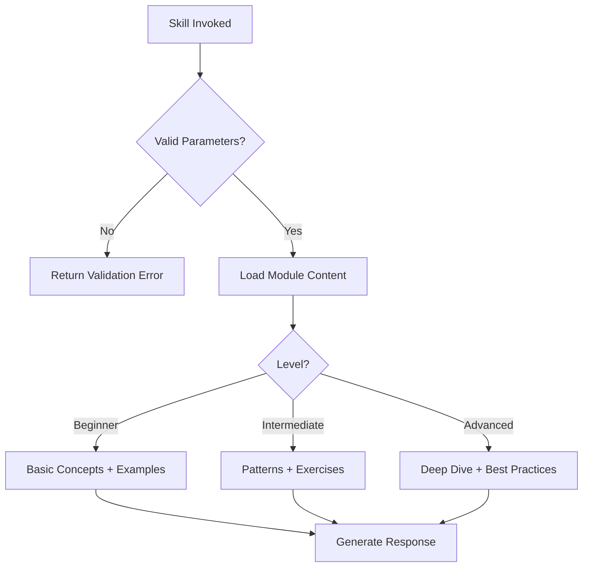

# PHP Fundamentals Skill

> Atomic skill for mastering modern PHP programming fundamentals

## Overview

This skill provides comprehensive training in modern PHP development, from basic syntax to advanced PHP 8.4 features. Designed for progressive learning with hands-on exercises.

## Skill Parameters

### Input Validation
```typescript
interface SkillParams {
  topic:
    | "syntax"           // Variables, operators, control structures
    | "oop"              // Classes, interfaces, traits
    | "type-system"      // Type declarations, unions, intersections
    | "php8-features"    // Modern PHP 8.x features
    | "composer"         // Dependency management
    | "standards";       // PSR compliance

  level: "beginner" | "intermediate" | "advanced";
  php_version?: "8.0" | "8.1" | "8.2" | "8.3" | "8.4";
  output_format?: "tutorial" | "reference" | "exercises";
}
```

### Validation Rules
```yaml
validation:
  topic:
    required: true
    allowed: [syntax, oop, type-system, php8-features, composer, standards]
  level:
    required: true
    allowed: [beginner, intermediate, advanced]
  php_version:
    default: "8.3"
```

## Learning Modules

### Module 1: PHP Syntax Fundamentals
```yaml
topics:
  - Variables and data types
  - Operators and expressions
  - Control structures (if, switch, match)
  - Loops (for, foreach, while)
  - Functions and closures
  - Error handling basics

exercises:
  - Build a calculator function
  - Create array manipulation utilities
  - Implement string processing functions

duration: 8-12 hours
prerequisites: none
```

### Module 2: Object-Oriented Programming
```yaml
topics:
  - Classes and objects
  - Properties and methods
  - Inheritance and polymorphism
  - Interfaces and abstract classes
  - Traits and composition
  - SOLID principles

exercises:
  - Design a Shape hierarchy
  - Implement Repository pattern
  - Build a simple DI container

duration: 15-20 hours
prerequisites: [syntax]
```

### Module 3: PHP 8.x Modern Features
```yaml
topics:
  php_8_0:
    - Named arguments
    - Constructor property promotion
    - Match expressions
    - Nullsafe operator
    - Attributes
    - Union types

  php_8_1:
    - Enums
    - Readonly properties
    - Fibers
    - Intersection types

  php_8_2:
    - Readonly classes
    - DNF types

  php_8_3:
    - Typed class constants
    - json_validate()
    - "#[Override]" attribute

  php_8_4:
    - Property hooks
    - Asymmetric visibility

duration: 10-15 hours
```

## Execution Flow



## Error Handling & Retry Logic

### Error Categories
```yaml
errors:
  INVALID_TOPIC:
    code: "SKILL_001"
    recovery: "Display available topics"

  VERSION_MISMATCH:
    code: "SKILL_002"
    recovery: "Suggest minimum version or alternative"
```

### Retry Strategy
```yaml
retry:
  max_attempts: 3
  backoff:
    type: exponential
    initial_delay_ms: 100
    max_delay_ms: 2000
    multiplier: 2
```

## Logging & Observability

### Event Hooks
```yaml
hooks:
  on_skill_start: [log_invocation, track_topic]
  on_module_complete: [update_progress, award_badge]
  on_error: [log_error, suggest_recovery]
  on_skill_complete: [recommend_next_skill]
```

## Code Examples

### Beginner: Basic Syntax
```php
<?php
declare(strict_types=1);

// Variables and types
$name = 'PHP Developer';
$version = 8.3;

// Match expression (PHP 8.0+)
$status = match($code) {
    200 => 'OK',
    404 => 'Not Found',
    default => 'Unknown',
};
```

### Intermediate: OOP Patterns
```php
<?php
declare(strict_types=1);

// Constructor property promotion (PHP 8.0+)
final readonly class User
{
    public function __construct(
        public int $id,
        public string $email,
        public string $name,
    ) {}
}
```

### Advanced: PHP 8.4 Features
```php
<?php
declare(strict_types=1);

// Property hooks (PHP 8.4+)
class Temperature
{
    public float $celsius {
        get => $this->celsius;
        set => $value >= -273.15 ? $value : throw new \InvalidArgumentException();
    }

    public float $fahrenheit {
        get => $this->celsius * 9/5 + 32;
        set => $this->celsius = ($value - 32) * 5/9;
    }
}
```

## Test Templates

```php
<?php
declare(strict_types=1);

use PHPUnit\Framework\TestCase;
use PHPUnit\Framework\Attributes\Test;

final class CalculatorTest extends TestCase
{
    #[Test]
    public function it_adds_two_numbers(): void
    {
        $calculator = new Calculator();
        $this->assertSame(5, $calculator->add(2, 3));
    }
}
```

## Troubleshooting

### Common Issues

| Problem | Cause | Solution |
|---------|-------|----------|
| Type errors | Strict types + wrong type | Check function signature, cast values |
| Autoloading failures | PSR-4 mismatch | Verify namespace, run composer dump-autoload |
| Deprecated features | Old PHP patterns | Update to modern syntax |

## Quality Metrics

| Metric | Target |
|--------|--------|
| Code example accuracy | 100% |
| PHP version correctness | 100% |
| PSR-12 compliance | 100% |

## Usage

```
Skill("php-fundamentals", {topic: "oop", level: "intermediate"})
```
