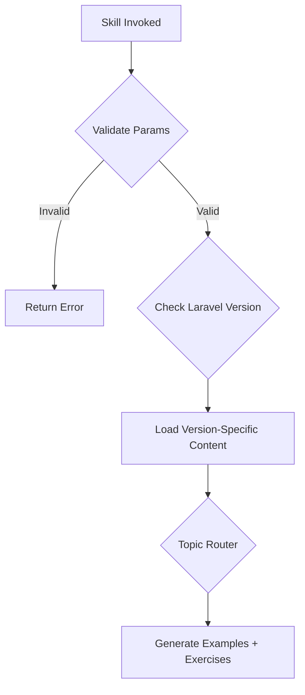

# Laravel Framework Skill

> Atomic skill for mastering Laravel application development

## Overview

Comprehensive skill for building production-ready Laravel applications. Covers Laravel 10.x-11.x with focus on Eloquent ORM, Blade templating, API development, and queues.

## Skill Parameters

### Input Validation
```typescript
interface SkillParams {
  topic:
    | "eloquent"         // ORM, relationships, queries
    | "routing"          // Routes, middleware, controllers
    | "blade"            // Templates, components, layouts
    | "authentication"   // Sanctum, Passport, Fortify
    | "queues"           // Jobs, workers, Horizon
    | "testing"          // Feature tests, factories
    | "api";             // API resources, versioning

  level: "beginner" | "intermediate" | "advanced";
  laravel_version?: "10" | "11";
  stack?: "livewire" | "inertia-vue" | "inertia-react" | "blade-only";
}
```

### Validation Rules
```yaml
validation:
  topic:
    required: true
    allowed: [eloquent, routing, blade, authentication, queues, testing, api]
  level:
    required: true
  laravel_version:
    default: "11"
```

## Learning Modules

### Module 1: Eloquent ORM Mastery
```yaml
beginner:
  - Model basics and conventions
  - CRUD operations
  - Basic relationships

intermediate:
  - Advanced relationships (morphTo, hasManyThrough)
  - Eager loading and N+1 prevention
  - Query scopes

advanced:
  - Custom casts and accessors
  - Performance optimization
  - Database transactions

exercises:
  - Build blog with posts, comments, tags
  - Implement soft deletes
  - Create polymorphic media system
```

### Module 2: API Development
```yaml
beginner:
  - API routes and controllers
  - JSON responses
  - Basic authentication (Sanctum)

intermediate:
  - API Resources and Collections
  - Pagination and filtering
  - Rate limiting

advanced:
  - OAuth with Passport
  - API versioning patterns
  - OpenAPI documentation
```

### Module 3: Queue Processing
```yaml
beginner:
  - Job basics and dispatching
  - Queue connections
  - Failed jobs handling

intermediate:
  - Job chaining and batching
  - Horizon monitoring

advanced:
  - Custom queue drivers
  - Saga patterns
```

## Execution Flow



## Error Handling & Retry Logic

```yaml
errors:
  VERSION_INCOMPATIBLE:
    code: "LARAVEL_001"
    recovery: "Suggest upgrade or alternative"

  PACKAGE_MISSING:
    code: "LARAVEL_002"
    recovery: "Provide composer require command"

retry:
  max_attempts: 3
  backoff:
    type: exponential
    initial_delay_ms: 100
```

## Code Examples

### Eloquent Model (Laravel 11)
```php
<?php
declare(strict_types=1);

namespace App\Models;

use Illuminate\Database\Eloquent\Factories\HasFactory;
use Illuminate\Database\Eloquent\Model;
use Illuminate\Database\Eloquent\Relations\BelongsTo;
use Illuminate\Database\Eloquent\Relations\HasMany;

final class Post extends Model
{
    use HasFactory;

    protected $fillable = ['title', 'slug', 'content', 'author_id'];

    protected function casts(): array
    {
        return [
            'published_at' => 'datetime',
        ];
    }

    public function author(): BelongsTo
    {
        return $this->belongsTo(User::class, 'author_id');
    }

    public function comments(): HasMany
    {
        return $this->hasMany(Comment::class);
    }

    public function scopePublished($query)
    {
        return $query->whereNotNull('published_at');
    }
}
```

### API Resource Controller
```php
<?php
declare(strict_types=1);

namespace App\Http\Controllers\Api\V1;

use App\Http\Controllers\Controller;
use App\Http\Resources\PostResource;
use App\Models\Post;
use Illuminate\Http\Response;

final class PostController extends Controller
{
    public function index()
    {
        return PostResource::collection(
            Post::with(['author'])->paginate(15)
        );
    }

    public function store(StorePostRequest $request)
    {
        $post = Post::create($request->validated());

        return (new PostResource($post))
            ->response()
            ->setStatusCode(Response::HTTP_CREATED);
    }
}
```

### Queue Job
```php
<?php
declare(strict_types=1);

namespace App\Jobs;

use App\Models\User;
use Illuminate\Bus\Queueable;
use Illuminate\Contracts\Queue\ShouldQueue;
use Illuminate\Queue\InteractsWithQueue;
use Illuminate\Queue\Middleware\WithoutOverlapping;

final class SendWelcomeEmail implements ShouldQueue
{
    use Queueable, InteractsWithQueue;

    public int $tries = 3;
    public int $backoff = 60;

    public function __construct(
        public readonly User $user,
    ) {}

    public function middleware(): array
    {
        return [new WithoutOverlapping($this->user->id)];
    }

    public function handle(): void
    {
        $this->user->notify(new WelcomeNotification());
    }
}
```

## Test Templates

```php
<?php
declare(strict_types=1);

namespace Tests\Feature\Api;

use App\Models\Post;
use App\Models\User;
use Illuminate\Foundation\Testing\RefreshDatabase;
use Laravel\Sanctum\Sanctum;
use Tests\TestCase;

final class PostApiTest extends TestCase
{
    use RefreshDatabase;

    public function test_can_list_posts(): void
    {
        Post::factory()->count(5)->create();

        $this->getJson('/api/v1/posts')
            ->assertOk()
            ->assertJsonCount(5, 'data');
    }

    public function test_authenticated_user_can_create(): void
    {
        Sanctum::actingAs(User::factory()->create());

        $this->postJson('/api/v1/posts', ['title' => 'Test'])
            ->assertCreated();
    }
}
```

## Troubleshooting

| Problem | Solution |
|---------|----------|
| N+1 queries | Use `with()` for eager loading |
| Queue jobs stuck | Check QUEUE_CONNECTION, run `queue:work` |
| Route not found | Run `route:clear`, check middleware |

## Quality Metrics

| Metric | Target |
|--------|--------|
| Code accuracy | 100% |
| Laravel conventions | 100% |
| N+1 prevention | 100% |

## Usage

```
Skill("php-laravel", {topic: "eloquent", level: "intermediate"})
```
