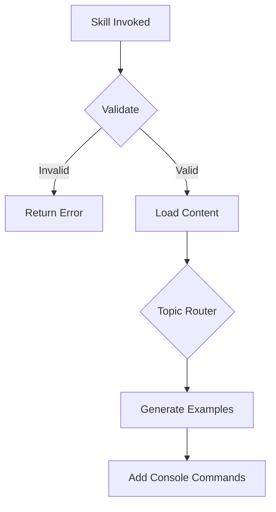

# Symfony Framework Skill

> Atomic skill for mastering enterprise-grade Symfony applications

## Overview

Comprehensive skill for building robust Symfony applications. Covers Symfony 6.4 LTS and 7.x with focus on Doctrine ORM, dependency injection, and API Platform.

## Skill Parameters

### Input Validation
```typescript
interface SkillParams {
  topic:
    | "doctrine"         // ORM, DBAL, migrations
    | "di-container"     // Services, autowiring, tags
    | "routing"          // Routes, controllers
    | "security"         // Voters, firewalls
    | "messenger"        // Async messaging
    | "api-platform"     // REST/GraphQL APIs
    | "forms";           // Form types, validation

  level: "beginner" | "intermediate" | "advanced";
  symfony_version?: "6.4" | "7.0" | "7.1" | "7.2";
  project_type?: "webapp" | "api" | "microservice";
}
```

### Validation Rules
```yaml
validation:
  topic:
    required: true
    allowed: [doctrine, di-container, routing, security, messenger, api-platform, forms]
  level:
    required: true
  symfony_version:
    default: "7.1"
```

## Learning Modules

### Module 1: Doctrine ORM
```yaml
beginner:
  - Entity creation with attributes
  - Basic relationships
  - Repository basics

intermediate:
  - DQL and QueryBuilder
  - Lifecycle events
  - Custom repository methods

advanced:
  - Inheritance mapping
  - Second-level cache
  - Event subscribers
```

### Module 2: Dependency Injection
```yaml
beginner:
  - Service basics
  - Autowiring
  - Constructor injection

intermediate:
  - Service tags
  - Factory services
  - Decorators

advanced:
  - Compiler passes
  - Service subscribers
  - Lazy services
```

### Module 3: Messenger Component
```yaml
beginner:
  - Messages and handlers
  - Sync vs async transports

intermediate:
  - Message middleware
  - Retry strategies
  - Multiple transports

advanced:
  - Custom transports
  - Saga patterns
```

## Execution Flow



## Error Handling & Retry Logic

```yaml
errors:
  CONTAINER_ERROR:
    code: "SYMFONY_001"
    recovery: "Run cache:clear, check services.yaml"

  DOCTRINE_ERROR:
    code: "SYMFONY_002"
    recovery: "Run doctrine:schema:validate"

retry:
  max_attempts: 3
  backoff:
    type: exponential
    initial_delay_ms: 100
```

## Code Examples

### Doctrine Entity
```php
<?php
declare(strict_types=1);

namespace App\Entity;

use App\Repository\ProductRepository;
use Doctrine\ORM\Mapping as ORM;
use Symfony\Component\Validator\Constraints as Assert;

#[ORM\Entity(repositoryClass: ProductRepository::class)]
#[ORM\HasLifecycleCallbacks]
class Product
{
    #[ORM\Id]
    #[ORM\GeneratedValue]
    #[ORM\Column]
    private ?int $id = null;

    #[ORM\Column(length: 255)]
    #[Assert\NotBlank]
    private string $name;

    #[ORM\ManyToOne(inversedBy: 'products')]
    #[ORM\JoinColumn(nullable: false)]
    private Category $category;

    #[ORM\Column]
    private \DateTimeImmutable $createdAt;

    public function __construct()
    {
        $this->createdAt = new \DateTimeImmutable();
    }
}
```

### Service with DI
```php
<?php
declare(strict_types=1);

namespace App\Service;

use App\Repository\ProductRepository;
use Doctrine\ORM\EntityManagerInterface;
use Psr\Log\LoggerInterface;
use Symfony\Component\DependencyInjection\Attribute\Autowire;

final readonly class ProductService
{
    public function __construct(
        private ProductRepository $repository,
        private EntityManagerInterface $entityManager,
        private LoggerInterface $logger,
        #[Autowire('%app.tax_rate%')]
        private float $taxRate,
    ) {}

    public function createProduct(array $data): Product
    {
        $product = new Product();
        $product->setName($data['name']);

        $this->entityManager->persist($product);
        $this->entityManager->flush();

        $this->logger->info('Product created', ['id' => $product->getId()]);

        return $product;
    }
}
```

### Messenger Handler
```php
<?php
declare(strict_types=1);

namespace App\MessageHandler;

use App\Message\SendOrderConfirmation;
use App\Service\EmailService;
use Symfony\Component\Messenger\Attribute\AsMessageHandler;

#[AsMessageHandler]
final readonly class SendOrderConfirmationHandler
{
    public function __construct(
        private EmailService $emailService,
    ) {}

    public function __invoke(SendOrderConfirmation $message): void
    {
        $this->emailService->sendOrderConfirmation($message->orderId);
    }
}
```

## Test Templates

```php
<?php
declare(strict_types=1);

namespace App\Tests\Functional;

use Symfony\Bundle\FrameworkBundle\Test\WebTestCase;

final class ProductControllerTest extends WebTestCase
{
    public function testListProducts(): void
    {
        $client = static::createClient();
        $client->request('GET', '/api/products');

        $this->assertResponseIsSuccessful();
    }
}
```

## Troubleshooting

| Problem | Solution |
|---------|----------|
| Service not found | Run `debug:container`, check autowiring |
| Doctrine mapping error | Run `doctrine:schema:validate` |
| Route not found | Run `debug:router`, check firewall |

## Quality Metrics

| Metric | Target |
|--------|--------|
| Code accuracy | 100% |
| Symfony conventions | 100% |
| DI best practices | 100% |

## Usage

```
Skill("php-symfony", {topic: "messenger", level: "advanced"})
```
